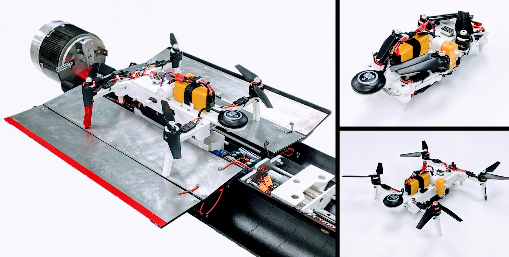
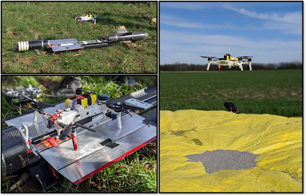
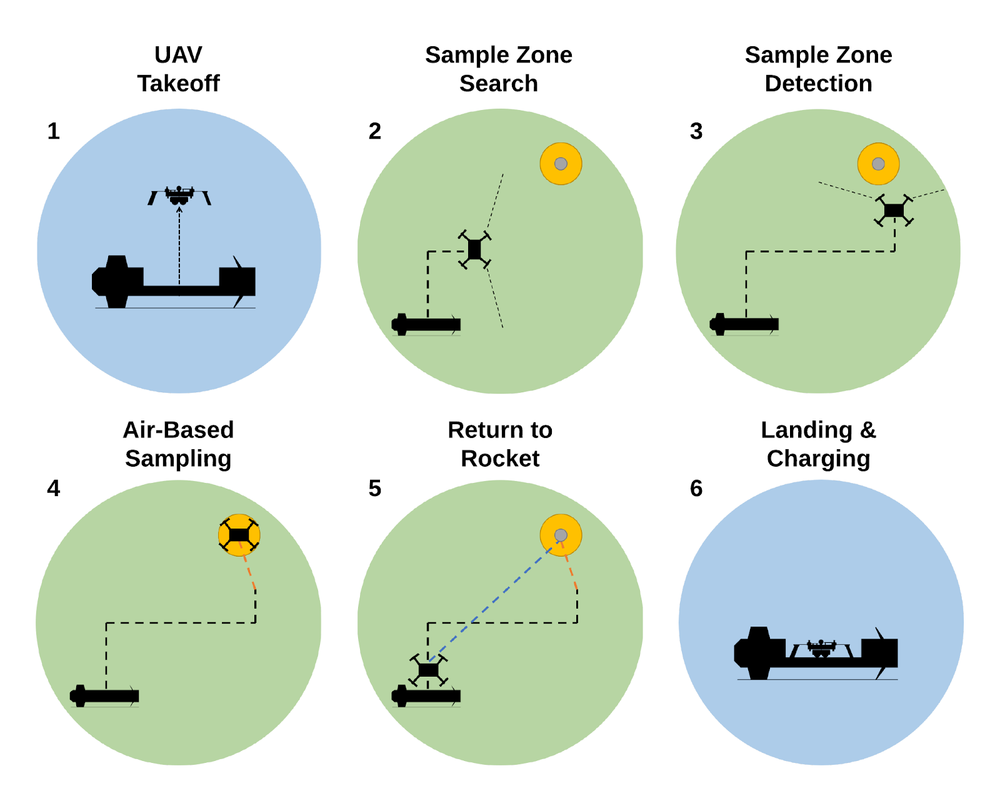
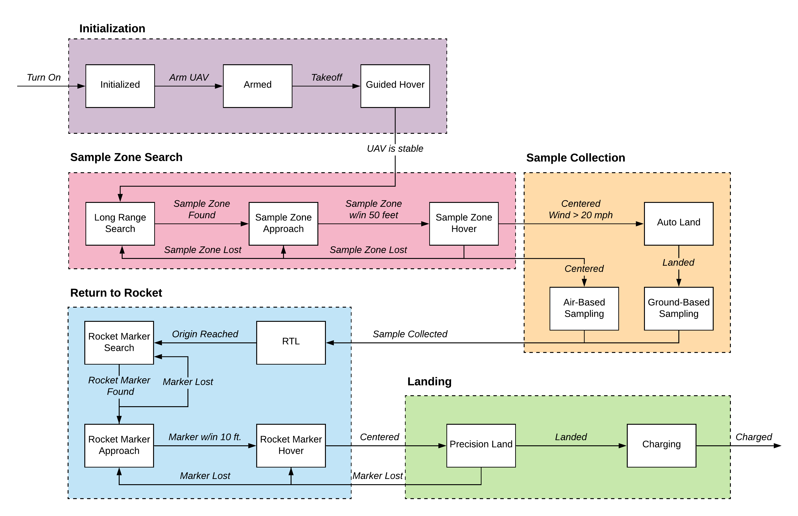
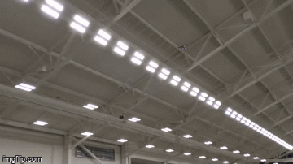

# VADL 2020

## Introduction

This repository contains the software developed by the Vanderbilt Aerospace Design Laboratory (VADL) 2020 design team. Each year the team competes in the [NASA University Student Launch Competition](https://www.nasa.gov/stem/studentlaunch/home/index.html). The NASA-defined goal of the 2019-2020 competition was to launch a rocket and payload that can recover a lunar ice sample from an unspecified location. VADL chose to design an unmanned aerial vehicle (UAV) that would be stored inside the rocket, deploy from the rocket after the rocket has landed on the ground, and autonomously complete a lunar sample collection mission. In addition, the team decided to tackle three extra challenges:

**Air-Based Sampling:** The UAV will collect the sample by hovering over the sampling zone and lowering a sampling tool to the ground. Lunar sample collection can be very challenging due to the diversity of environments that can be found on the moon. Since the UAV does not have to land to sample, it will be able to sample from areas inaccessible to a rover or traditional UAV, such as steep slopes and narrow or rocky terrain.

**Fully Autonomous Flight:** The UAV will be capable of autonomous image-based guidance, navigation, and control. It will be able to operate independently from GPS and magnetometers. Autonomous flight is essential so that the UAV can operate in real-time, as opposed to being teleoperated from Earth.

**Contact Charging Station:** A charging station has been added to the rocket as an alternative to carrying a large power source onboard the UAV. This will allow the UAV to be much lighter, with improved control and flight time, and enable repeatable missions after recharging.

The VADL 2020 team's goal is to create a novel UAV and rocket that solve some of the greatest challenges facing space exploration: robust sample collection, real-time navigation and control, and repeatibility. 

The picture below shows our fullscale rocket and payload. The rocket is ~10ft long and 5.5" diameter. The UAV and charging station are housed in the payload bay. Once the rocket is launched and reaches apogee, drogue and main parachutes are used to safely recover the rocket on the ground. Once on the ground, the rocket autonomously reorients and opens the payload bay (which is split into thirds) to allow for the UAV and charging station to deploy.

The UAV has foldable arms and legs so it can fit in the rocket. Once the payload bay opens, the UAV arms and legs passively open and lock into place. After the sample collection mission, the UAV returns to the rocket and lands on the charging station. The UAV has metal contacts on two of its legs that allow for current to flow to the battery once they contact the metal charging platform.

The photos below show the UAV in action during a flight test. The right photo showcases air-based sampling. The sampling tool is lowered on a winch and is electrically independent from the main UAV.

## Autonomy

VADL has developed software for UAV autonomous flight using both GPS and [SLAM](https://en.wikipedia.org/wiki/Simultaneous_localization_and_mapping) localization. GPS is great because it's already available for most drones and doesn't require much work to implement. The downside is that it can only localize the drone within a few meters accuracy. SLAM is a method of localizing the UAV in an unknown environment without any external aids, such as GPS. 

The mission sequence is broken down into 6 stages.

A state machine is used to model the autonomous mission sequence.

## Repository Structure

- *camera_calibration:* Calibration scripts for pinhole and fisheye cameras.  
- *docs*: Additional documentation about our development process.
- *dronekit_tests:*  Test various [Dronekit](https://dronekit-python.readthedocs.io/en/latest/) navigation commands.  
- *feather_com:* Sampling tool wireless communication code.  
- *marker_detection:* Image processing for color and Aruco markers.  
- *slam:* Implements V-SLAM to stabilize and control the UAV.  
- *utils:* Utility functions for wireless communication, dronekit, and files.

## Project Status

All marker tracking image processing algorithms have been tested and completed. GPS-based autonomous navigation has been implemented and SLAM autonomous flight is nearly complete. We have demonstrated extremely stable indoor SLAM flight and have flown outdoors with moderate amounts of our drift. One of our flights can be seen below. The UAV autonomously takes off, travels 120 feet, and returns to its origin to land. Landing has been demonstrated with approximately 5 cm accuracy. Precision landing with Aruco markers has also been demonstrated. The Initialization, Sample Zone Search, and Landing stages of the state machine have been implemented.

Due to the coronavirus pandemic, the in-person NASA competition was canceled and all continuing work on this project has ended. Fortunately, the team has already finished building the rocket and UAV and has successfully performed a fullscale launch and sample collection mission. 

## Future Work
The real challenge of future work will be to extend the length of outdoor autonomous SLAM flights. We have observed drift of up to 20 feet after flying only 250 feet. If the Intel Realsense continues to be used, the only option is to fully characterize the expected drift and add in scale factors to deal with this limitation. VADL could also look into alternative SLAM methods (perhaps [ORB-SLAM](https://webdiis.unizar.es/~raulmur/orbslam/), [VINS-mono](https://github.com/HKUST-Aerial-Robotics/VINS-Mono)) that may perform better. 

