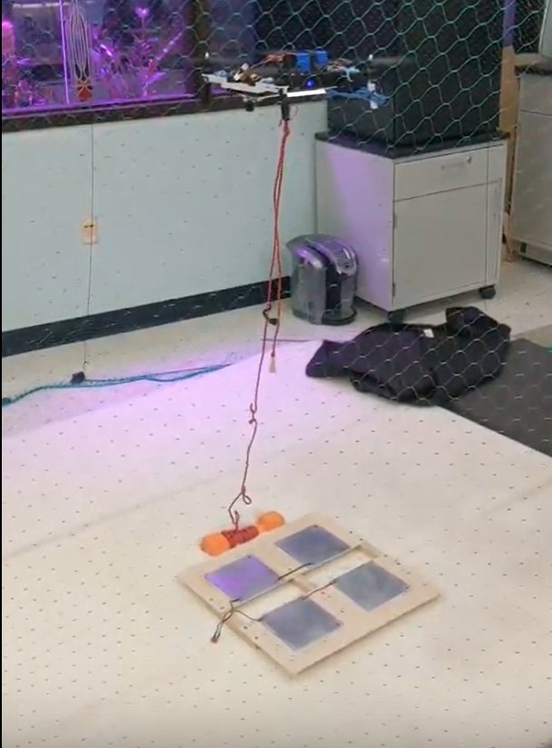
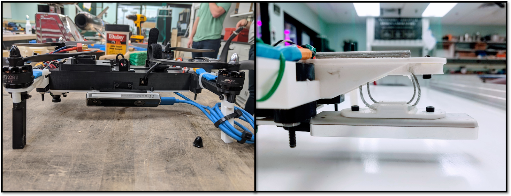
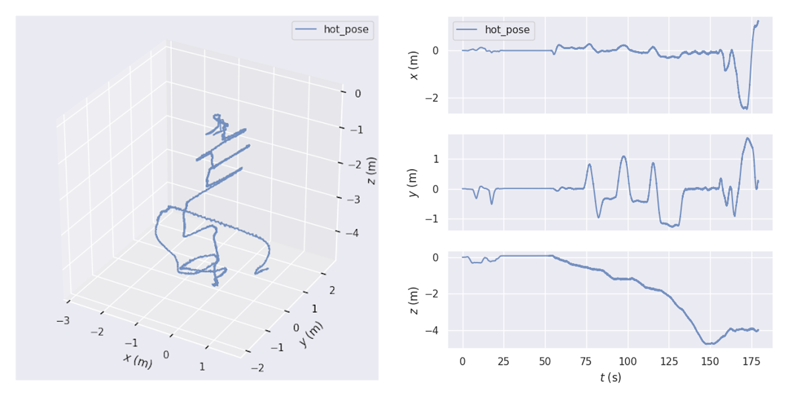

# Achieving SLAM Flight
## Indoor SLAM Flight
The first step towards achieving full SLAM-guided autonomy was successfully getting the UAV off the ground while localizing itself with SLAM data. This alone was a great challenge. The Intel Realsense T265 V-SLAM sensor was chosen since it is an off-the-shelf solution that allowed the team to focus purely on applying SLAM to novel situations. To begin utilizing the SLAM module, a program was written to send position estimates from the Realsense to the Pixhawk flight controller. The Pixhawk normally expects a position estimate from a GPS module, but it was configured to expect a SLAM-based estimate instead. The position estimate from the Realsense must be transformed to the standard North East Down (NED) reference frame used by the Pixhawk. This pose transformation is shown below and each step is represented by a number. The pose obtained from the Realsense is in the Realsense reference frame (2). First, the pose of the UAV body in the Realsense reference frame is obtained (1 x 2). Then, the transformation between the NED and Realsense reference frames (3) can be used to obtain the pose of the UAV body in the NED reference frame (4).

                
With the pose transformation complete, the team achieved successful indoor flight using SLAM. The Realsense was initially mounted at a 45-degree angle due to size constraints of fitting in the rocket. The first indoor flight is shown below.

               
## Outdoor SLAM Flight

The Intel Realsense V-SLAM tracking camera was originally mounted on the side of the UAV and parallel to its body. This design choice was made because the UAV already barely fit inside the rocket and this was the only location the sensor could fit. Since the sensor must be able to track a lot of features, the mount was angled to 45 degrees so that it could see most of the ground. After the successful indoor SLAM flight, we attempted the same flight outdoors. The UAV experienced localization failure immediately after takeoff and flew uncontrollably upwards. It was initially unclear why the same flight failed outdoors when it worked so well indoors. 

After much experimentation, we narrowed this issue down to three potential causes: vibration, scale of the environment, and the Realsense mounting configuration. Vibration seemed to be an issue since the Realsense worked fine when being held in a person’s hand. However, tracking divergence occurred whenever it was mounted on the UAV. The IMU data was logged and the results showed significant vibration being transmitted through the Realsense. The scale of the environment could also have been a concern since that was one of the only factors that had changed between the indoor and outdoor flights. The Realsense mounting configuration was considered since there was no evidence that anyone had successfully used the Realsense in a similar orientation before.

We discovered the problem to be a mixture of these three issues. High vibrations increase the chance that the Realsense localization will fail. The scale of the environment by itself is not an issue, but when coupled with high vibration, it can lead to failure. The mounting configuration was switched to a downward-facing configuration and this eliminated the problem: when the Realsense is facing downward, the scale of the environment is consistent, whereas at 45 degrees there is a large disparity between the close and far away features. In addition, a new cable isolator mount was designed to dampen vibration. While vibration and scale together can still cause issues, they are largely mitigated by these changes to the mounting configuration that can be seen below (new config on the right). The position data from the first successful outdoor flight as well.

Since this flight, we have performed numerous flight tests to try and characterize the pose drift over different distances flown. While we did not have time to collect enough data to confidently point out trends, we did observe up to 20 feet of drift after flying 120 feet forward and back on a grass field. More tests should be conducted to determine the relationship between drift and speed, distance flown, and altitude. 
