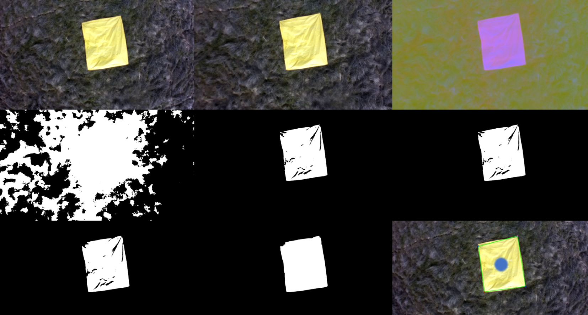
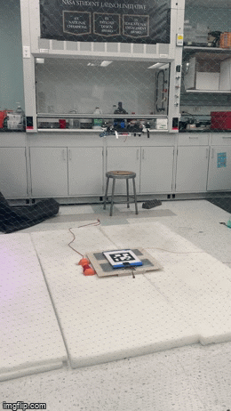

# Marker Detection

Marker detection is used in this project to detect and navigate to the sample zone and to perform precision landing. 
The sample zone is a 10'x10' yellow tarp with a 3' diameter sampling zone in the middle. Color image processing is 
used to detect the yellow tarp and then marker pose estimation is performed. Aruco markers are used for precision landing.

- [camera.py](camera.py): Camera classes that handle threaded video streaming and writing from webcams and Pi cams.
- [long_range_search.py](long_range_search.py): Testing sample zone detection capabilities at the extremes of the fisheye camera FOV.
- [marker_hover.py](marker_hover.py): Functions to detect, approach, and hover over a colored or Aruco marker. 
- [marker_tracker.py](marker_tracker.py): Classes for detecting color and Aruco markers and performing pose estimation.
- [record_video.py](record_video.py): Script to record vidoes on Pi or laptop using VideoStream objects in [camera.py](camera.py).
- [simple_pi_record.py](simple_pi_record.py): Even simpler recording script just for the Pi.

An example of the sample zone detection pipeline.

An example of Aruco precision landing.

