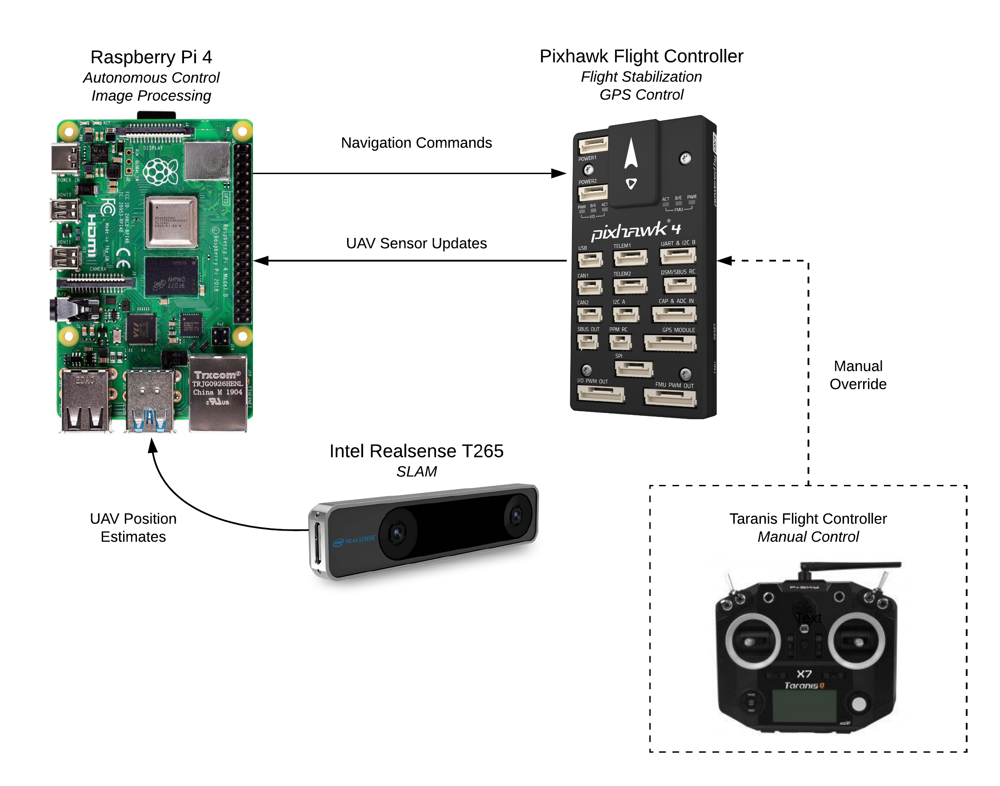
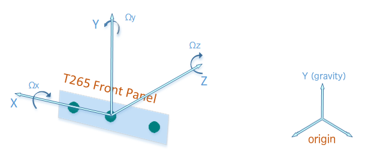

# SLAM 

## Overview 

Simultaneous Localization and Mapping (SLAM) is the problem of constructing a map of an unknown environment while simultaneously navigating a robot through that environment. It's been a heavily researched topic for many years, but still has a long way to go before it can be widely adopted as a universal robotic localization method. For this UAV, VADL tried to implement SLAM because it is a promising solution to the challenge of planetary space exploration. Since there is no GPS on the Moon or Mars, a UAV will have to track its position without any external aid. The rovers currently on Mars are manually controlled and tracked by a few satellites orbiting the planet. This means that the rovers can only crawl along, barely moving throughout their entire life span. A UAV with SLAM could explore new environments and return to previous locations all without manual control.

## Implementation

The team used the [Intel Realsense T265 V-SLAM tracking camera](https://www.intelrealsense.com/tracking-camera-t265/), an off-the-shelf SLAM solution. The T265 is a remarkable product, but it's very new and quite finnicky. If you're having some problems working with this sensor, our own development problems might provide some insight, which are documented [here](../docs/achieving_slam_flight.md). 

Below is an overview of the electronics used for guidance, navigation, and control. 

**Raspberry Pi 4:** The Raspberry Pi 4 is the on-board processor that handles autonomous UAV control. Its primary benefits for software are its large amount of processing power for its small dimensions and its ease of use with the other GNC components. The Raspberry Pi will be running all the image processing algorithms for sample zone detection, air-based sampling, and charging station landing.  

**Pixhawk Flight Controller:** The Pixhawk handles flight stabilization and motor control. The Pi sends navigation commands to the Pixhawk and the Pixhawk sends UAV sensor updates back to the Pi. These sensor updates will be used by the image processing algorithms to update the autonomous navigation commands sent by the Pi.

**Intel Realsense T265:** The Intel Realsense performs V-SLAM localization and sends a UAV position estimate to the Raspberry Pi. The Raspberry Pi will use this position estimate to navigate back to the rocket after the UAV performs air-based sampling. Messages are sent over MAVlink. Refer to [realsense_localization.py](realsense_localization.py) for more details.

**Manual Remote Controller:** The Taranis QX7 flight controller is used to manually fly the UAV. Manual overrides have been programmed into the autonomy code so that the flight operator can always step in autonomous navigation fails.



The following documentation describes how to set up and run SLAM flight.

# SLAM Flight

## Setting up the Raspberry Pi

The Raspberry Pi must be set up to read data from the Realsense and communicate with the Pixhawk. Refer to the [complete installation guide](../docs/raspberry_pi_ubuntu_mate_setup.md) relevant sections or follow the whole guide if starting without an OS.

## Configuring the Pixhawk for SLAM Flight

There a few steps that must be completed to set up the Pixhawk to receive pose data from the Realsense instead of a GPS module. First, make sure that Arducopter 3.7 or later is loaded on the Pixhawk. Next, set these parameters on the Pixhawk:

- AHRS_EKF_TYPE = 2
- EK2_ENABLE = 1 
- EK3_ENABLE = 0
- EK2_GPS_TYPE = 3
- EK2_POSNE_M_NSE = 0.1
- EK2_VELD_M_NSE = 0.1
- EK2_VELNE_M_NSE = 0.1
- BRD_RTC_TYPES = 2
- GPS_TYPE = 0

(Optional)
- COMPASS_USE = 0
- COMPASS_USE2 = 0
- COMPASS_USE3 = 0

The Pixhawk may have issues arming with all these parameters. We have received compass alignment errors, related to the fact that the Pixhawk is receiving very different compass readings from the Realsense and the actual compass (I'm not sure that COMPASS_USE actually disables the compass). To solve this, we set COMPASS_USE to 1 to trick the Pixhawk pre-arm checks. With this set, the Pixhawk still doesn't use the compass so all is well.  

## UAV Reference Frames

The only work that you will (probably) have to do yourself is figure out the pose transformation from the Realsense coordinate system to the UAV body coordinate system. This is dependent on the Realsense mounting orientation. There are a few transformations already in [realsense_localization.py](realsense_localization.py) but you can add your own if necessary. This pose transformation is necessary because the Pixhawk handles all localization and navigation commands within the NED reference frame. If the Realsense pose was sent straight to the Pixhawk, it would misinterpret all the commands. 

Included pose transformations:
- Forward facing, USB towards the right
- Downward facing, USB towards the left
- Downward facing, USB towards the front
- 45 degree angle, USB towards the front

If your mounting configuration is already included in the script, then congrats! You can skip this section. Just double check the transformation is correct, otherwise your UAV might decide it wants to fly to space and go berserk. 

Here are details to help determine your pose transformation:

The Realsense coordinate system is shown below. The y-axis is always aligned with gravity. The x and z axes are aligned depending on the Realsense orientation when the sensor is initialized.



Now to the transformation. First define the axes:

0: NED Origin Frame  
1: Realsense (RS) Origin Frame  
2: UAV NED coord. system  
3: RS coord. system  

Now define the matrices that describe the reference frames relative to each other. The convention HX_Y means defining the Y frame relative to the X frame:

H0_2: UAV NED frame relative to NED origin (this is the pose we want to send to the Pixhawk)

H0_1: RS Origin relative to NED origin

H1_3: RS Frame relative to RS Origin (this is the pose received from the Realsense)

H3_2: NED Frame relative to RS Frame

First we receive H1_3 from the Realsense. We then multiply this by H3_2 to get the pose in the NED frame relative to the RS origin. Next, convert the RS origin to the NED origin by multiplying by H0_1. The full equation becomes: 


H0_2 = H0_1.dot(H1_3.dot(H3_2))


### Downward-Facing Initialization Problems

At the time of this project (Feb. 2020), the Realsense does not support initializing the sensor with the cameras facing downward. The internal axes become randomly assigned, so while the pose data is self-consistent, you will have no way of understanding it in terms of real-world movements. The sensor can be used downward-facing if it is first initialized at an angle and then tilted down. This was not possible for our UAV since it must deploy from the rocket in flight configuration. We instead tried mounting it at 45 degrees relative to the ground, but this quickly led to tracking divergence when coupled with standard flight vibrations. Therefore, we recommend mounting the Realsense either forward-facing (initializes correctly) or downward-facing and angling the UAV during initialization.

## Flying with SLAM Hover

With the Pixhawk and Pi set up, run this script from the root directory to start SLAM flight:

```
sudo python3 slam/tests/realsense_localization_test.py 
```

After everything intializes, confidence messages will start being printed to the terminal:

```
INFO: Tracking confidence: HIGH
```

If the tracking confidence is MEDIUM or HIGH than the UAV is ready for flight. If it is LOW, try picking up the UAV and moving it around a bit. If it is still LOW or FAILED, restart the Pixhawk and script.

If the Realsense is mounted downward-facing, then hold the UAV at an angle when starting the script. Once the tracking confidence is being printed, place the UAV level. 

Manual flight works the same as with the GPS: Switch to LOITER mode to fly. ALT HOLD and STABILIZE do not use the Realsense. When writing autonomous scripts, use GUIDED, same as you would with GPS.

It is very possible that during flight the Realsense tracking will diverge. This is primarily caused by high vibrations and temporarily blocking the cameras. Once tracking diverges, there is no way to recover and a manual override should be activated. *Always* have the option to switch into ALT HOLD or STABILIZE mode in case something goes wrong. 

## Analyzing Data

[realsense_localization.py](realsense_localization.py) and [log_realsense.py](log_realsense.py) save pose and vibration data from the Realsense in the [data](data/) folder. To view this data, install the Evo tool:

```
pip install evo --upgrade --no-binary evo 
```

To view 3D and 2D plots of the pose, run:

```
evo_traj tum -p pose_file_1.txt pose_file_2.txt
```

When the logging script is terminated, it may have written a partial line in .txt file. Delete this line if evo_traj throws an error. There are a few examples that can be run in the [data](data/) folder.

To plot vibration data, run [plot_accel.py](plot_accel.py). This will plot the vibration in the x, y, and z axes versus time.

## Tests 

A few scipts are included in [tests/](tests/) to verify functionality and perform flight tests.

[realsense_localization_test.py](tests/realsense_localization_test.py): Creates a thread that receives data from the Realsense and sends data to the Pixhawk. **Run this script to manually fly in SLAM mode**.

[realsense_waypoint.py](tests/realsense_waypoint.py): Autonomously fly a set distance and log data. Use this to analyze pose drift and the desired flight path compared to the actual flight path.

[t265_test_streams.py](tests/t265_test_streams.py): Test connecting to the Realsense.
